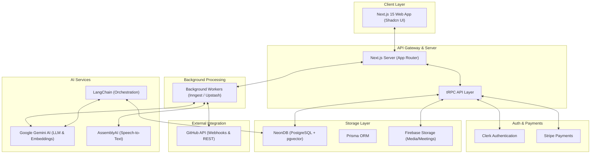
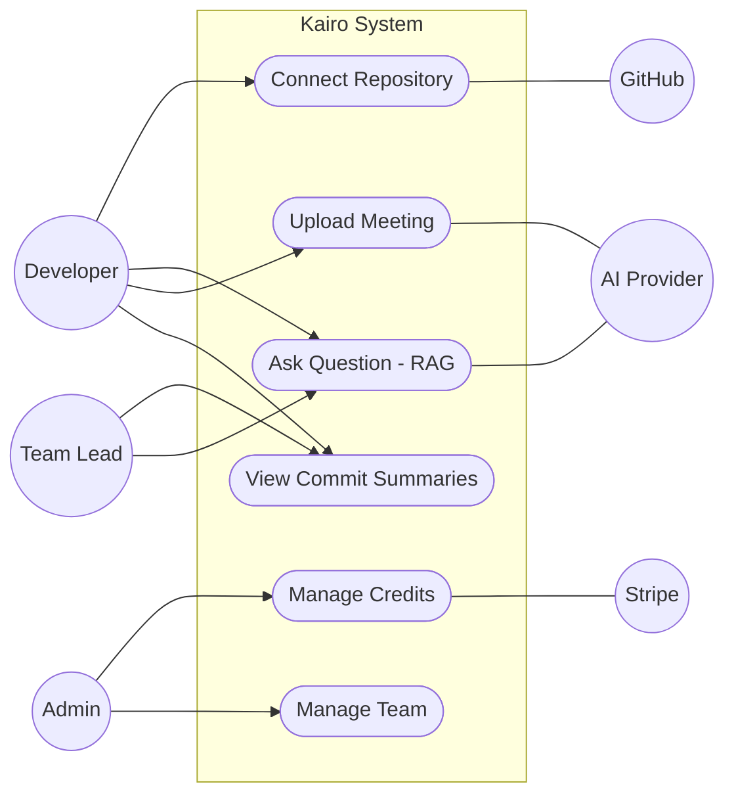
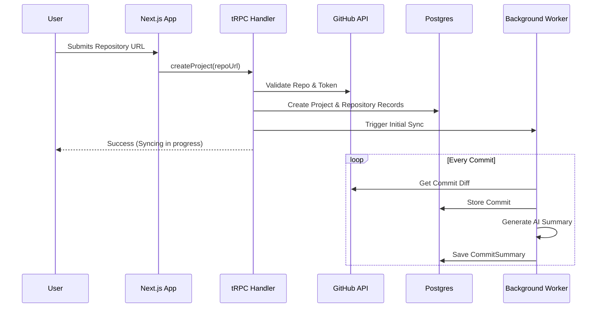
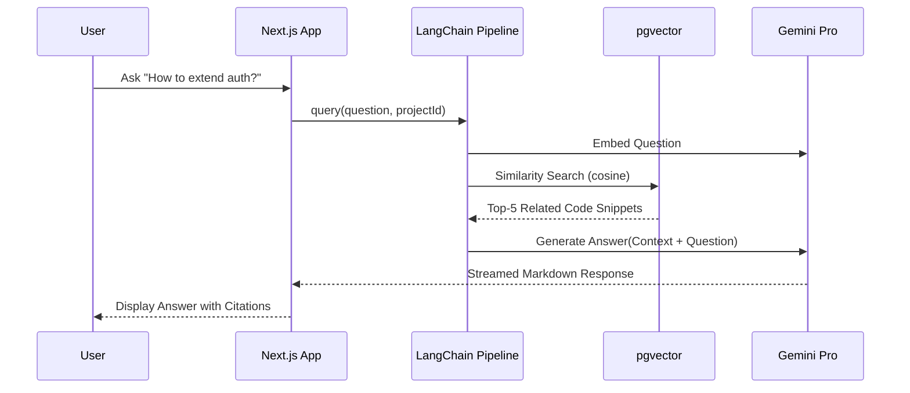
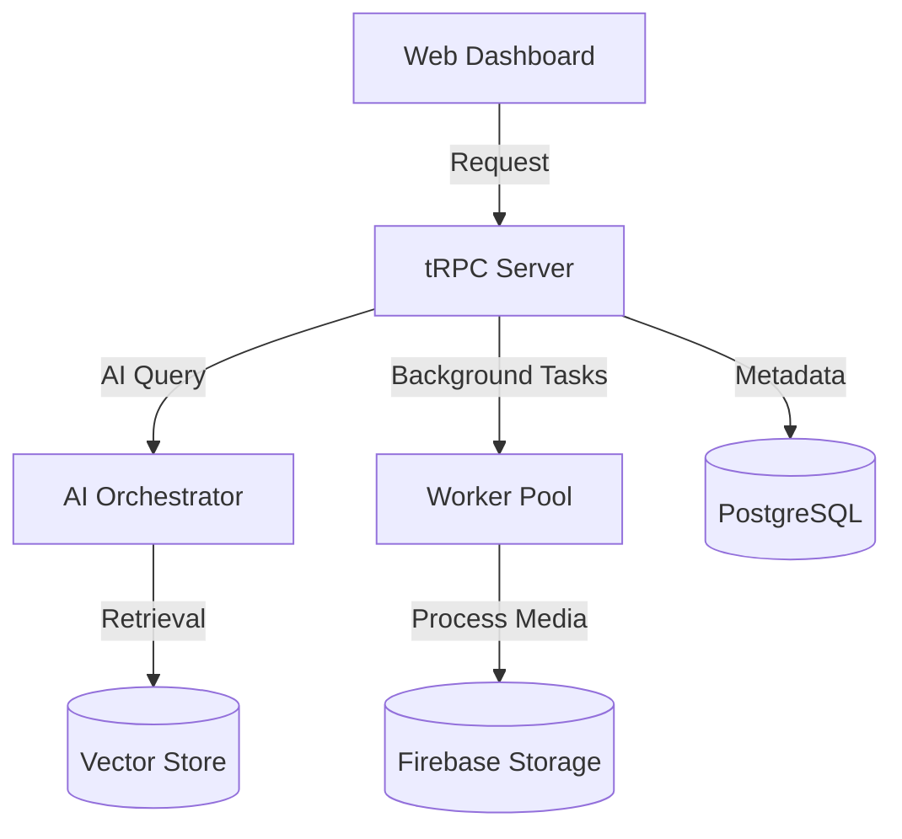
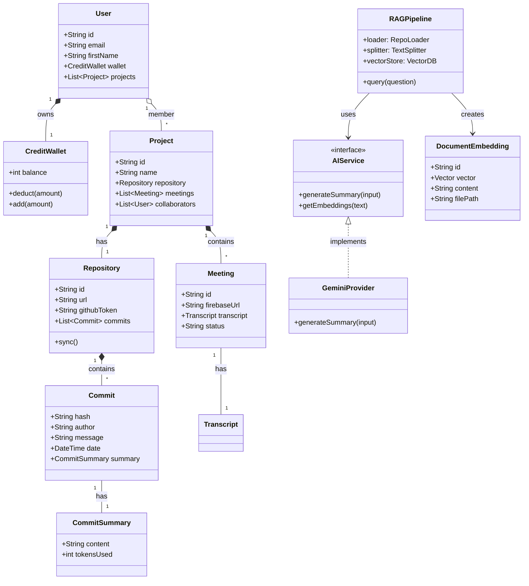
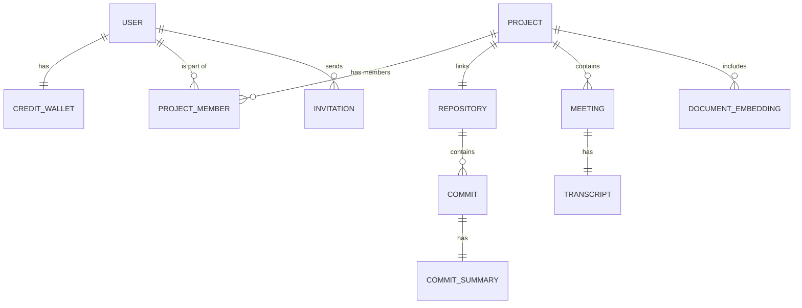
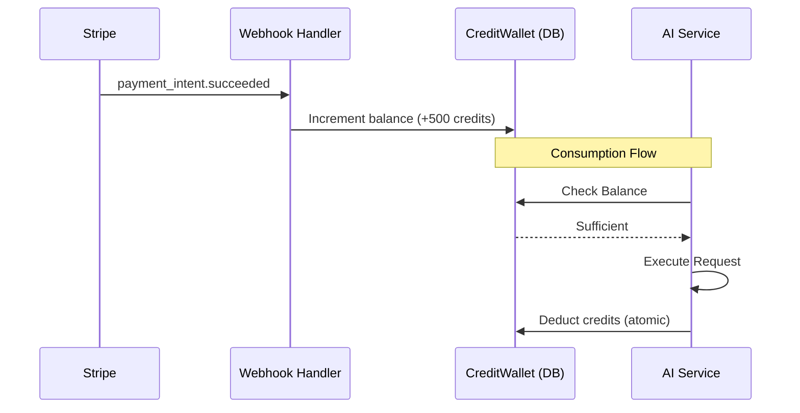
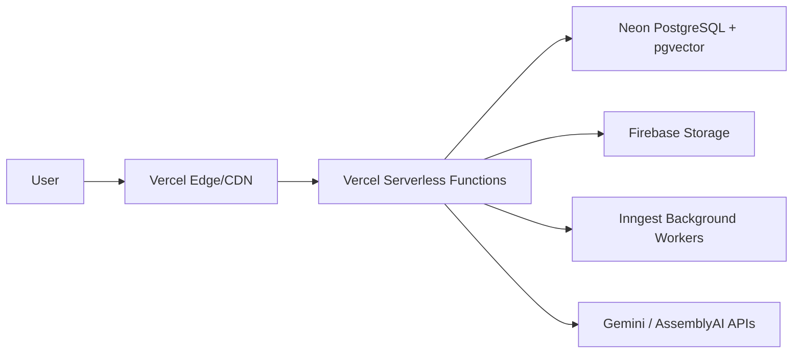

# KAiro SYSTEM ARCHITECTURE AND IMPLEMENTATION PLAN

## 1. PRODUCT UNDERSTANDING

**Kairo** is an AI-driven "Intelligence Layer" for software development teams. It bridges the gap between raw technical data (code, commits) and human collaboration (meetings, discussions) using Large Language Models (LLMs) and Retrieval-Augmented Generation (RAG).

### Problem Solved
- **Information Silos**: Knowledge is trapped in git history, code comments, and recorded meetings.
- **Onboarding Friction**: New developers struggle to understand complex codebases.
- **Meeting Fatigue**: Critical decisions in meetings are often lost or poorly documented.

### User Personas
- **Developer**: Wants to quickly understand a new module or the rationale behind a specific commit.
- **Team Lead**: Needs progress summaries and high-level technical oversight.
- **Project Manager**: Tracks credit usage and manages team access/collaborations.

### Core Workflows
1. **Repository Onboarding**: Connecting GitHub -> Syncing Metadata -> AI Indexing.
2. **Contextual Q&A**: Asking natural language questions about the code (e.g., "How does authentication work?").
3. **Meeting Intelligence**: Uploading a recording -> Transcription -> AI Summary -> Searchable knowledge.

### Data & AI Lifecycle
1. **Ingestion**: Fetching data from GitHub/Firebase.
2. **Transformation**: Processing diffs/transcripts into vector embeddings.
3. **Storage**: Standard metadata in PostgreSQL; vector embeddings in `pgvector`.
4. **Reasoning**: Gemini AI processes retrieved context to answer user queries.

### Credit Consumption Lifecycle
- **Refill**: User purchases credits via Stripe.
- **Allocation**: Credits added to `CreditWallet`.
- **Deduction**: AI operations (summarization, Q&A, meeting analysis) deduct credits based on token usage or execution time.
- **Thresholds**: Preventive measures for low-balance scenarios.

---

## 2. HIGH LEVEL ARCHITECTURE (HLD)



---

## 3. LOW LEVEL DESIGN (LLD)

### GitHub Sync Flow
1. **Trigger**: User links repo.
2. **Initial Ingestion**: Fetch latest 50 commits + full file tree.
3. **Persistence**: Store `Repository` and `Commit` metadata.
4. **AI Trigger**: Push commit diffs to a queue for summarization.

### RAG Indexing Pipeline
1. **Source**: Files from the repository.
2. **Splitting**: Code-aware splitting (AST-based or recursive character) via LangChain.
3. **Embedding**: `GoogleGenerativeAIEmbeddings` transforms chunks into 768-dim vectors.
4. **Storage**: Bulk upsert into `DocumentEmbedding` table with `pgvector` index.

### Query Answering Flow
1. **Input**: User asks a question.
2. **Retrieval**: Embed question -> Similarity search in `pgvector`.
3. **Context Construction**: Inject top-k snippets into System Prompt.
4. **Generation**: Gemini generates answer with file citations.
5. **Streaming**: Response is streamed via Vercel AI SDK to the UI.

### Credit Deduction Logic
- **Atomic Operation**: Credits must be deducted *before* or *during* AI execution.
- **Unit Calculation**: 
    - Commit Summary: 1 credit per commit.
    - RAG Query: 5 credits per query.
    - Meeting Analysis: 1 credit per minute of audio.

### Error Handling & Retries
- **Exponential Backoff**: For GitHub and AI API rate limits.
- **Dead Letter Queues (DLQ)**: For failed background tasks (e.g., meeting processing).
- **Graceful Degradation**: If RAG is down, fallback to metadata-only search.

---

## 4. COMPLETE UML DIAGRAM SET

### A. Use Case Diagram


### B. Sequence Diagrams

#### 1. Repository Onboarding


#### 2. RAG Question Answering


### C. Component Diagram


---

## 5. FULL CLASS DIAGRAM



---

## 6. DATABASE DESIGN

### ER Diagram


### Table Descriptions
- **USER**: Core identity (Clerk linked).
- **CREDIT_WALLET**: Atomic credit tracking.
- **REPOSITORY**: GitHub metadata and configuration.
- **DOCUMENT_EMBEDDING**: 
    - `id`, `projectId`, `content`, `filePath`, `embedding` (type `vector(768)`).
- **COMMIT_SUMMARY**: AI-generated reports per commit.

---

## 7. RAG ARCHITECTURE

1. **Repository Loader**: Clones/Fetched repo structure via GitHub API.
2. **Document Splitter**: Recursive character splitting with language priority (e.g., split by classes/functions for `.ts` files).
3. **Embedding Generation**: Gemini `text-embedding-004` model.
4. **Vector Storage**: NeonDB with `HNSW` or `IVFFlat` index for high-speed similarity search.
5. **Context Injection**:
   ```typescript
   const prompt = `You are a senior engineer. Use the following code snippets to answer the user's question. 
   Snippets: ${retrievedContext}
   Question: ${userQuestion}`;
   ```

---

## 8. REALTIME & ASYNC PROCESSING

- **Inngest Workflow**:
    - `syncRepo`: Triggers ingestion + summarization.
    - `processMeeting`: Upload to AssemblyAI -> Poll Status -> Save Transcript.
- **Streaming Responses**: Using `experimental_streamText` for immediate user feedback.
- **Stripe Webhooks**: Listen for `checkout.session.completed` to instantly update `CreditWallet`.

---

## 9. CREDIT & BILLING ARCHITECTURE



---

## 10. SECURITY ARCHITECTURE

- **Authentication**: Clerk JWT validation on all tRPC procedures.
- **Authorization**: Project-based RBAC (Owner, Member).
- **Secrets**: GitHub tokens encrypted at rest (AES-256-GCM).
- **Sanitization**: Prompt injection filtering for RAG queries.

---

## 11. SCALABILITY & HARDENING

- **Vector Optimization**: Use `HNSW` indices in PG for < 100ms search latency on millions of rows.
- **Caching**: Redis (Upstash) for frequent AI responses and GitHub metadata.
- **Rate Limiting**: Tiered limiters (Project level vs Global level).
- **Horizontal Scaling**: Stateless Vercel functions scale automatically with traffic.

---

## 12. DEPLOYMENT ARCHITECTURE



---

## 13. IMPLEMENTATION ROADMAP

### Phase 1: Core Platform
- **Modules**: Auth, Project CRUD, Credit Wallet.
- ** इंजीनियरिंग Order**: Database Schema -> Clerk Integration -> Basic UI.

### Phase 2: GitHub Intelligence
- **Modules**: GitHub OAuth, Sync Worker, Commit Summarizer.
- ** इंजीनियरिंग Order**: GitHub API Service -> Background Jobs -> AI Integration.

### Phase 3: RAG Engine
- **Modules**: Vector DB Setup, LangChain Pipeline, Citation UI.
- ** इंजीनियरिंग Order**: pgvector setup -> Embeddings Pipeline -> Streaming Chat.

### Phase 4: Meeting AI
- **Modules**: Firebase Uploads, AssemblyAI Integration, Transcript UI.
- ** इंजीनियरिंग Order**: Media Processor -> Transcription Service -> Q&A on Transcripts.

### Phase 5: Billing & Polish
- **Modules**: Stripe Integration, Usage Analytics, Dark Mode, Mobile Optimization.
- ** इंजीनियरिंग Order**: Checkout Flow -> Webhooks -> Dashboards.

### Phase 6: Scaling & Observability
- **Modules**: Redis Caching, Error Monitoring (Sentry), HNSW Indexing.
- ** इंजीनियरिंग Order**: Performance Audits -> Index Tuning -> Analytics.
